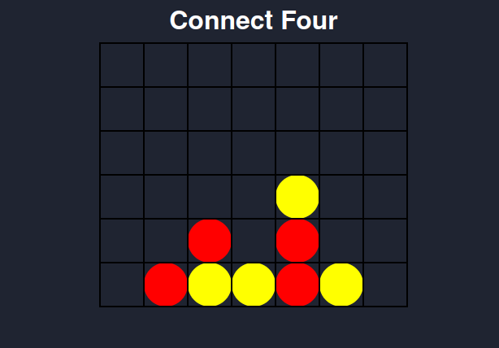
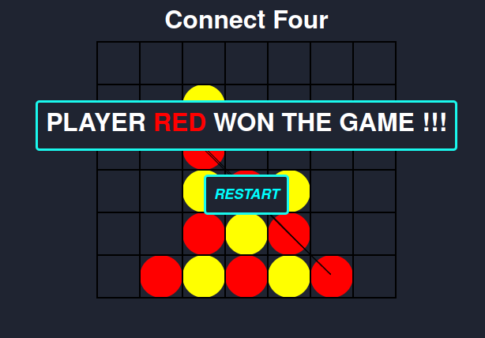

Connect Four
=
[**Connect Four**][0] is a simple game similar to [Tic-tac-toe][1] where if you *connect four tokens* of your color (red or yellow) **you win!**

In this case the game is *smooth and dark theme* which is quite relaxing to play.

**Connect Four** is played with 2 players (e.g. you and your friend) and it's a great compromise between the simplicity of [Tic-tac-toe][1] and the complexity of [Chess][2].

How to play
-
Just open [index.html](/index.html) in a web page and you are ready to play!

Credits
-
Part of the games is based on the [Rough.js](https://roughjs.com/ "roughjs.com") library

[0]: https://en.wikipedia.org/wiki/Connect_Four
"See wiki"
[1]: https://en.wikipedia.org/wiki/Tic-tac-toe
"See wiki"
[2]: https://en.wikipedia.org/wiki/Chess
"See wiki"
